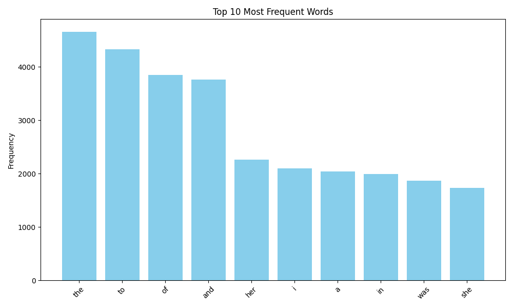

# Word Frequency Analysis Using MapReduce in Python

This Python project demonstrates how to perform word frequency analysis using the **MapReduce paradigm**. It downloads a public domain book from Project Gutenberg, analyzes the text to find the most common words, and visualizes the results.

## 🔧 Features

- ✅ Downloads text from a given URL
- ✅ Performs MapReduce-based word frequency analysis
- ✅ Utilizes multithreading for parallel mapping
- ✅ Visualizes the top N most frequent words using `matplotlib`
- ✅ Saves results to `.png`, `.txt`, and `.json` formats

## 📦 Requirements

Install dependencies via pip:

```bash
pip install matplotlib requests
```

## 🚀 How It Works

1. **Download Text**: Fetches a `.txt` file from the URL (default: _Pride and Prejudice_ by Jane Austen).
2. **Map Phase**: Splits the text into chunks and counts word frequencies in parallel threads.
3. **Shuffle Phase**: Groups all word counts by word.
4. **Reduce Phase**: Aggregates the counts to get total frequencies.
5. **Visualization**: Plots the top 10 most frequent words in a bar chart.

## 📁 Output Files

After execution, the script will generate:

- `top_words.png` – Bar chart of the top words
- `top_words.txt` – Text list of top words and their counts
- `top_words.json` – JSON dictionary of top words

## 🧪 Example

Here's an example of the output graph:



## 📝 Usage

Run the script:

```bash
python word_count_mapreduce.py
```

To change the number of threads or top-N words, edit these constants in the script:

```python
TOP_N = 10
NUM_THREADS = 4
```
